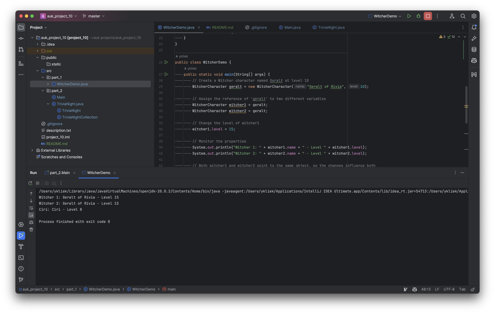
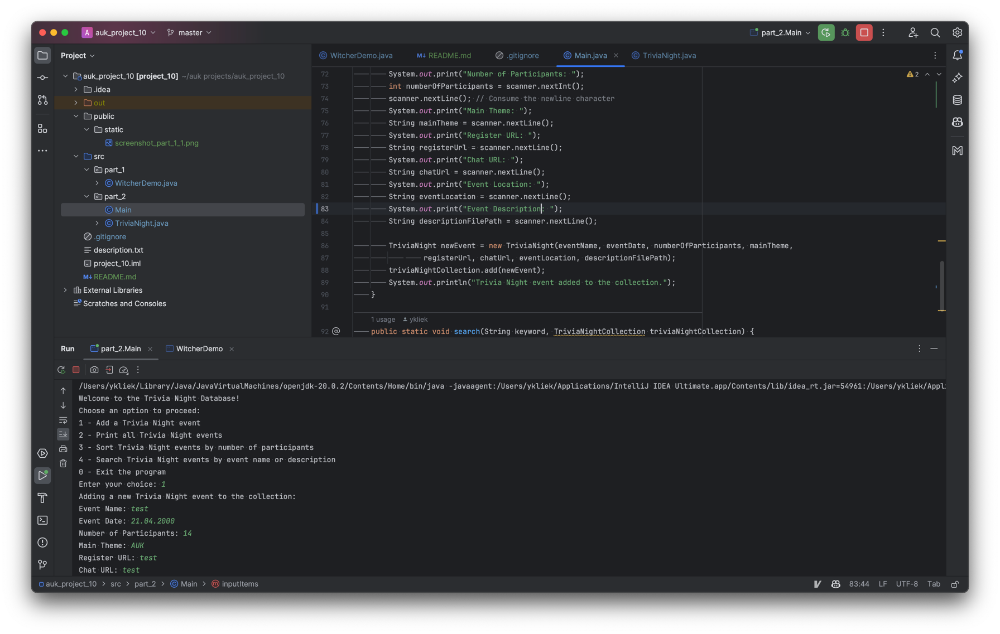

# UK SDT 100: Principles of Programming FA23: Project 10. Classes and objects (Part 2)

A series of Java projects demonstrating various programming techniques and best practices.

## Table of Contents

- [File Structure](#file-structure)
- [Part 1: Witcher Demo](#part-1-witcher-demo)
- [Part 2: Trivia Night Class Demonstration](#part-2-trivia-night-class-demonstration)

## File Structure

<pre>
project_9
│
├── public
│   └── static
│       └── [screenshots]
│
├── src
│   ├── part_1
│   │   └── WitcherDemo.java
│   │
│   └── part_2
│       ├── Main.java
│       └── TriviaNight.java
│
├── .gitignore
├── README.md
└── project_10.iml
</pre>

# Part 1: Witcher Demo
Demonstrate reference assignments and reference method arguments.

# Part 2: Trivia Night Class Demonstration

## Introduction
This README outlines the creation and usage of the `TriviaNight` class, which is an artifact representing the hobby of organizing Trivia Nights.

## Features
1. The class encompasses properties such as register URL, chat URL, event location, and an event description.
2. The event description can be read from a file.
3. It contains getter and setter methods for most of its properties.

## Screenshots

